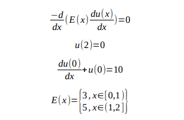
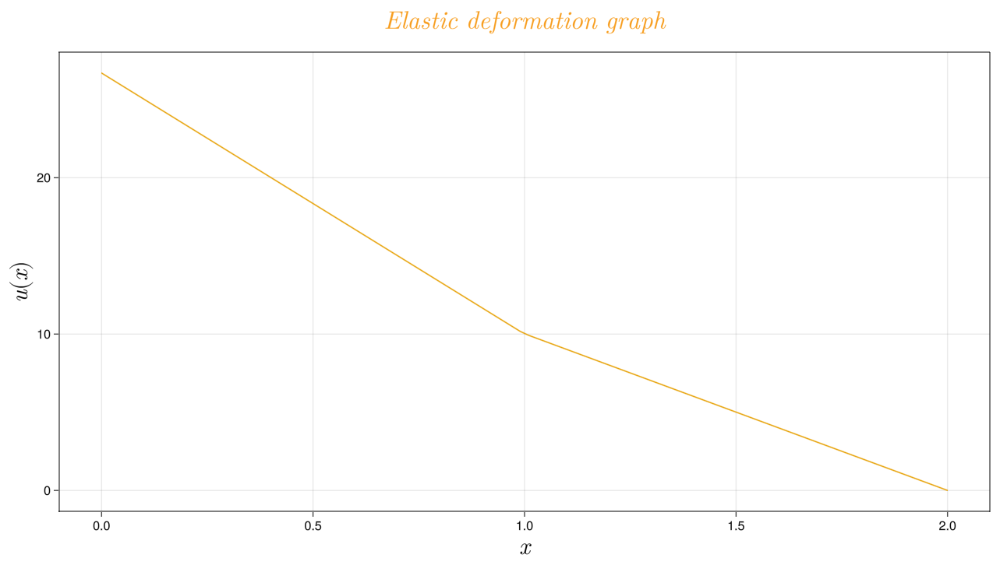

# Elastic deformation equation using FEM
Project for differential equations course at the AGH
To run a code:
```
DifferentialEquationProject1.main()
```
The only dependency is GLMakie used for visualization.

Initial problem

<p align="center">
  
</p>

For full solution go to [report](report.pdf).

Graph of example solution:

